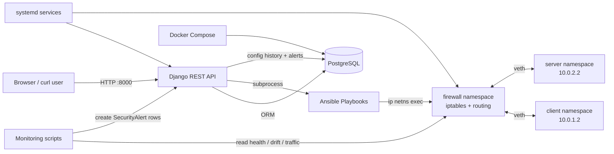

# NetGuardAutomator

Small MVP for a network security automation lab. This slice creates a simulated network with Linux network namespaces, applies firewall rules manually and with Ansible, and exposes early Django REST APIs for policies, routes, config history, rollback requests, and alerts.

## Current MVP Scope

1. Create a namespace topology:

   ```text
   client_ns <-> firewall_ns <-> server_ns
   ```

2. Apply manual `iptables` firewall rules.
3. Apply the same firewall policy with Ansible.
4. Store firewall rules, static routes, config snapshots, rollback requests, and alerts through REST APIs.

## Hosted Demo Vs Self-Hosted Lab

There are two ways to test NetGuardAutomator.

### Hosted Oracle Demo

If the Oracle Cloud VM is running and public ingress for TCP `8000` is enabled, testers do not need to run a VM or install anything locally. They can use the hosted API directly:

```text
http://150.136.56.25:8000/api/firewall-rules/
http://150.136.56.25:8000/api/routes/
http://150.136.56.25:8000/api/config-history/
http://150.136.56.25:8000/api/alerts/
```

Use the Oracle VM public IP:

```text
150.136.56.25
```

### Self-Hosted Lab

If someone wants to run the full lab themselves, they need their own Linux environment because the project uses Linux network namespaces and `iptables`.

Good options:

- Ubuntu VM
- WSL2
- Multipass Ubuntu VM
- Oracle Cloud Ubuntu VM
- Local Linux machine

For self-hosting, they clone this repo, run the setup commands, and use the IP address of their own environment:

```text
127.0.0.1:8000                 from inside their own VM
<their_vm_private_ip>:8000      from inside their cloud/private network
<their_vm_public_ip>:8000       from their browser if they expose port 8000
```

For public access to your hosted demo, Oracle ingress can allow:

```text
0.0.0.0/0 -> TCP 8000
```

To make it private again, restrict the source to trusted public IPs:

```text
<trusted_public_ip>/32 -> TCP 8000
```

Do not expose PostgreSQL ports `5432` or `5433` publicly.

## Architecture



Runtime flow:

```text
FirewallRule / StaticRoute API records
        -> POST /api/apply-config/
        -> render config snapshot
        -> run Ansible
        -> apply iptables/routes inside namespaces
        -> store ConfigSnapshot stdout/stderr
        -> monitoring scripts create SecurityAlert records
```

Key directories:

```text
backend/   Django REST API, models, serializers, config apply and rollback logic
ansible/   Inventory, firewall/route/rollback playbooks, templates
lab/       Linux namespace setup and teardown scripts
monitor/   Health, drift, route, and traffic detection scripts
deploy/    systemd service files for hosted Oracle VM deployment
docs/      Deployment guide and project documentation
```

## Why Django?

Django acts as the control plane for the lab. It does not forward packets itself; Linux namespaces, veth links, and `iptables` handle the actual network behavior.

Django is used for:

- REST APIs for firewall rules, static routes, config history, rollback, and alerts.
- PostgreSQL-backed models for `FirewallRule`, `StaticRoute`, `ConfigSnapshot`, and `SecurityAlert`.
- Config rendering from enabled policy records into Ansible variables and `iptables`-style snapshots.
- Automation orchestration through `subprocess` calls to Ansible playbooks.
- Audit history by storing rendered configs, Ansible stdout/stderr, timestamps, and success/failure state.
- Rollback by replaying a saved config snapshot through Ansible.
- Monitoring visibility by exposing health, drift, route, and traffic alerts through `/api/alerts/`.

## Git Workflow

Use `dev` for active development and merge into `main` only after a phase is tested.

```bash
git switch dev
git pull
```

After testing a phase, open a pull request from `dev` into `main`.

## Requirements

- Linux host, WSL2, or Linux VM
- `sudo`
- `iproute2`
- `iptables`
- `python3`
- `ansible`
- Docker and Docker Compose for PostgreSQL
- Django REST Framework dependencies from `requirements.txt`

macOS does not support Linux network namespaces directly, so run these commands inside a Linux environment.

## 1. Create The Lab Topology

```bash
sudo ./lab/setup_namespaces.sh
```

This creates:

- `client` namespace: `10.0.1.2/24`
- `firewall` namespace: `10.0.1.1/24` and `10.0.2.1/24`
- `server` namespace: `10.0.2.2/24`

Verify client-to-server routing:

```bash
sudo ./lab/test_connectivity.sh
```

## 2. Apply Manual Firewall Rules

```bash
sudo ./lab/apply_manual_firewall.sh
```

The policy allows:

- ICMP from client to server
- TCP port 80 from client to server
- Established return traffic

Everything else forwarded through the firewall is dropped.

HTTP test:

```bash
sudo ip netns exec server python3 -m http.server 80
sudo ip netns exec client curl http://10.0.2.2/
```

## 3. Apply Firewall Rules With Ansible

```bash
sudo ansible-playbook -i ansible/inventory.ini ansible/playbooks/apply_firewall.yml
```

The rules are defined in:

```text
ansible/group_vars/lab.yml
```

## 4. Run The Django REST API

Install dependencies:

```bash
python3 -m venv .venv
source .venv/bin/activate
pip install -r requirements.txt
```

Start PostgreSQL:

```bash
docker compose up -d postgres
```

Create a local environment file:

```bash
cp .env.example .env
```

The project defaults to PostgreSQL on `localhost:5433`, and Django automatically loads `.env`.

Run migrations and start the API:

```bash
cd backend
python manage.py migrate
python manage.py runserver 0.0.0.0:8000
```

Verify PostgreSQL is being used:

```bash
python manage.py shell -c "from django.conf import settings; print(settings.DATABASES['default']['ENGINE'])"
```

Expected output:

```text
django.db.backends.postgresql
```

Example API calls:

```bash
curl -X POST http://127.0.0.1:8000/api/firewall-rules/ \
  -H "Content-Type: application/json" \
  -d '{"source_ip":"10.0.1.2","destination_ip":"10.0.2.2","protocol":"tcp","port":80,"action":"ALLOW","enabled":true}'

curl http://127.0.0.1:8000/api/firewall-rules/

curl -X POST http://127.0.0.1:8000/api/routes/ \
  -H "Content-Type: application/json" \
  -d '{"namespace":"client","destination_cidr":"10.0.2.0/24","next_hop":"10.0.1.1"}'

curl -X POST http://127.0.0.1:8000/api/apply-config/

curl http://127.0.0.1:8000/api/config-history/

curl http://127.0.0.1:8000/api/alerts/

curl -X POST http://127.0.0.1:8000/api/rollback/1/
```

`POST /api/apply-config/` renders enabled rules, writes Ansible runtime variables, runs the firewall and route playbooks, and stores stdout/stderr in config history.

Because applying namespace firewall rules requires elevated privileges, the Django process must be able to run Ansible with `become: true`. In the Multipass VM, the default `ubuntu` user usually has passwordless sudo.

After calling `/api/apply-config/`, verify the namespace firewall state:

```bash
sudo ip netns exec firewall iptables -S FORWARD
```

Rollback replays the saved snapshot config with Ansible:

```bash
curl -X POST http://127.0.0.1:8000/api/rollback/1/ | python -m json.tool
sudo ip netns exec firewall iptables -S FORWARD
```

## 5. Run Monitoring Scripts

Run these from the project root inside the Linux VM with the virtual environment activated:

```bash
source .venv/bin/activate
```

Health check:

```bash
python monitor/health_check.py
```

Drift detection compares current firewall namespace rules against the latest successfully applied config snapshot:

```bash
python monitor/drift_detector.py
```

Traffic simulation creates a high severity alert if request volume exceeds the threshold:

```bash
python monitor/ddos_detector.py --requests 100 --threshold 50
```

To simulate an automated response, add `--auto-block`. This creates a temporary DENY rule and calls the Ansible-backed config apply flow:

```bash
python monitor/ddos_detector.py --requests 100 --threshold 50 --auto-block
```

View alerts through the API:

```bash
curl http://127.0.0.1:8000/api/alerts/
```

Route verification compares static routes stored in the API database against routes inside each namespace:

```bash
python monitor/route_verifier.py
```

Example route workflow:

```bash
curl -X POST http://127.0.0.1:8000/api/routes/ \
  -H "Content-Type: application/json" \
  -d '{"namespace":"client","destination_cidr":"10.0.99.0/24","next_hop":"10.0.1.1"}'

curl -X POST http://127.0.0.1:8000/api/apply-config/ | python -m json.tool

python monitor/route_verifier.py
```

## 6. Run The End-To-End Demo

Start PostgreSQL and Django first:

```bash
docker compose up -d postgres
cd backend
python manage.py migrate
python manage.py runserver 0.0.0.0:8000
```

In another terminal, run:

```bash
cd ~/network-security-automation-lab
source .venv/bin/activate
./scripts/demo.sh
```

The demo script resets demo firewall and route records, recreates the namespace topology, starts a temporary HTTP server in the `server` namespace, applies API-backed config with Ansible, verifies firewall/route/health/drift behavior, tests rollback, and creates a traffic-volume alert.

Demo screenshot and output checklist:

```text
docs/demo-evidence.md
```

## 7. Run Tests

The test suite uses an in-memory SQLite database automatically, even though the runtime app defaults to PostgreSQL.

```bash
cd backend
python manage.py test
```

The tests cover API creation/listing, policy validation, config rendering, mocked Ansible apply, rollback snapshot replay, and alert listing.

## 8. Deploy On Oracle Cloud

The full lab requires a Linux VM because it uses network namespaces, `iptables`, Docker, and long-running Django services.

Use the Oracle Cloud deployment guide:

```text
docs/deploy-oracle-cloud.md
```

For a public demo, Oracle Cloud ingress can allow TCP `8000` from `0.0.0.0/0`, which makes the API reachable at:

```text
http://<ORACLE_VM_PUBLIC_IP>:8000/api/firewall-rules/
```

To make it private again, change the TCP `8000` ingress source to trusted public IPs only:

```text
<trusted_public_ip>/32
```

Do not expose PostgreSQL ports `5432` or `5433` publicly.

## Cleanup

```bash
sudo ./lab/teardown_namespaces.sh
```
