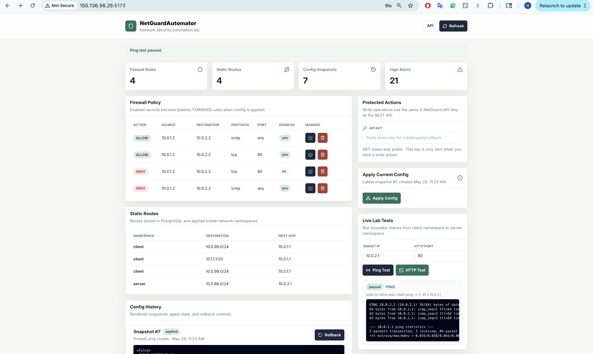
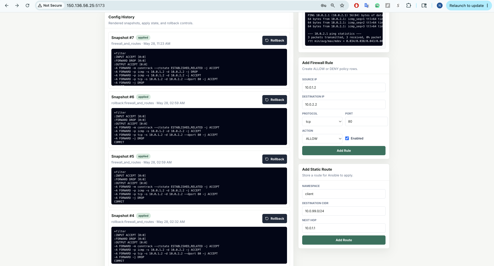
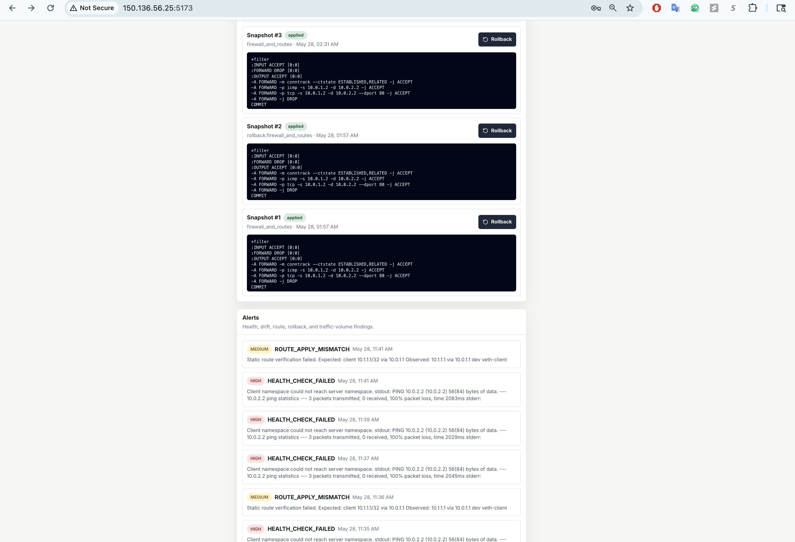
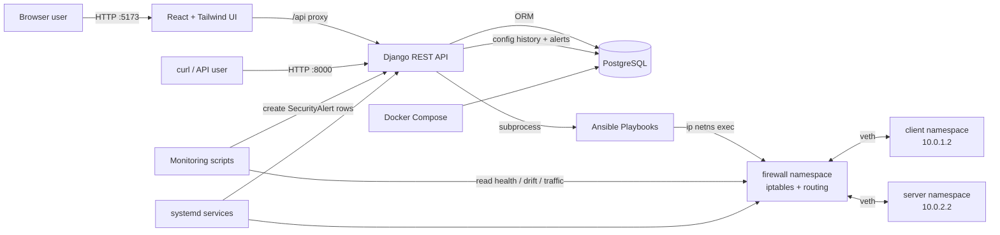

# NetGuardAutomator

Small MVP for a network security automation lab. This slice creates a simulated network with Linux network namespaces, applies firewall rules manually and with Ansible, exposes Django REST APIs for policies, routes, config history, rollback requests, and alerts, and provides a React + Tailwind dashboard for the lab workflow.

## Dashboard Preview







## Current MVP Scope

1. Create a namespace topology:

   ```text
   client_ns <-> firewall_ns <-> server_ns
   ```

2. Apply manual `iptables` firewall rules.
3. Apply the same firewall policy with Ansible.
4. Store firewall rules, static routes, config snapshots, rollback requests, and alerts through REST APIs.
5. View and operate the lab through a React dashboard.

## Hosted Demo Vs Self-Hosted Lab

There are two ways to test NetGuardAutomator.

### Hosted Oracle Demo

If the Oracle Cloud VM is running and public ingress is enabled, testers do not need to run a VM or install anything locally. They can use the hosted React dashboard and API directly:

```text
http://150.136.56.25:5173/
http://150.136.56.25:8000/api/firewall-rules/
http://150.136.56.25:8000/api/routes/
http://150.136.56.25:8000/api/config-history/
http://150.136.56.25:8000/api/alerts/
http://150.136.56.25:8000/api/lab-tests/ping/?target=10.0.2.2
http://150.136.56.25:8000/api/lab-tests/http/?target=10.0.2.2&port=80
```

Use the Oracle VM public IP:

```text
150.136.56.25
```

### Self-Hosted Lab

If someone wants to run the full lab themselves, they need their own Linux environment because the project uses Linux network namespaces and `iptables`.

Good options:

- Ubuntu VM
- WSL2
- Multipass Ubuntu VM
- Oracle Cloud Ubuntu VM
- Local Linux machine

For self-hosting, they clone this repo, run the setup commands, and use the IP address of their own environment:

```text
127.0.0.1:8000                 from inside their own VM
<their_vm_private_ip>:8000      from inside their cloud/private network
<their_vm_public_ip>:8000       from their browser if they expose port 8000
```

For public access to your hosted demo, Oracle ingress can allow:

```text
0.0.0.0/0 -> TCP 8000
```

To make it private again, restrict the source to trusted public IPs:

```text
<trusted_public_ip>/32 -> TCP 8000
```

Do not expose PostgreSQL ports `5432` or `5433` publicly.

## Architecture



Runtime flow:

```text
FirewallRule / StaticRoute API records
        -> POST /api/apply-config/
        -> render config snapshot
        -> run Ansible
        -> apply iptables/routes inside namespaces
        -> store ConfigSnapshot stdout/stderr
        -> monitoring scripts create SecurityAlert records
```

Dashboard workflow:

```text
Reviewer opens React UI on :5173
        -> UI reads public GET endpoints
        -> reviewer can inspect rules, routes, snapshots, alerts, and live tests
        -> write actions require X-NetGuard-API-Key
        -> Apply Config pushes database state into Linux namespaces
```

Key directories:

```text
backend/   Django REST API, models, serializers, config apply and rollback logic
frontend/  React + Tailwind dashboard for policy, route, snapshot, and alert workflows
ansible/   Inventory, firewall/route/rollback playbooks, templates
lab/       Linux namespace setup and teardown scripts
monitor/   Health, drift, route, and traffic detection scripts
deploy/    systemd service files for hosted Oracle VM deployment
docs/      Deployment guide and project documentation
```

## Why Django?

Django acts as the control plane for the lab. It does not forward packets itself; Linux namespaces, veth links, and `iptables` handle the actual network behavior.

Django is used for:

- REST APIs for firewall rules, static routes, config history, rollback, and alerts.
- Live lab test endpoints for bounded ping and HTTP checks from the `client` namespace.
- PostgreSQL-backed models for `FirewallRule`, `StaticRoute`, `ConfigSnapshot`, and `SecurityAlert`.
- Config rendering from enabled policy records into Ansible variables and `iptables`-style snapshots.
- Automation orchestration through `subprocess` calls to Ansible playbooks.
- Audit history by storing rendered configs, Ansible stdout/stderr, timestamps, and success/failure state.
- Rollback by replaying a saved config snapshot through Ansible.
- Monitoring visibility by exposing health, drift, route, and traffic alerts through `/api/alerts/`.

## React Dashboard

The React UI lives in `frontend/`. It reads public API data and sends the `X-NetGuard-API-Key` header only for protected write actions.

Dashboard features:

- Summary cards for firewall rules, static routes, config snapshots, and high severity alerts.
- Firewall policy table with enable, disable, and delete controls.
- Static route table.
- Config history with rendered iptables/static route snapshots and rollback controls.
- Alert feed from health, drift, route, rollback, and traffic-volume checks.
- Protected forms for adding firewall rules and static routes.
- Apply Config button that triggers the Ansible-backed config push.
- Live Lab Tests panel that runs bounded ping and HTTP checks from the `client` namespace.

The Live Lab Tests panel accepts:

```text
Target IP: 10.0.2.2
HTTP Port: 80
```

The backend restricts live test targets to the lab address range:

```text
10.0.0.0/8
```

Start Django first:

```bash
cd backend
python manage.py runserver 0.0.0.0:8000
```

Then start the frontend in another terminal:

```bash
cd frontend
npm install
npm run dev
```

Open:

```text
http://127.0.0.1:5173/
```

The Vite dev server proxies `/api/...` to Django on `127.0.0.1:8000`, so no CORS changes are needed for local development.

On the Oracle VM, keep the dashboard running with systemd:

```bash
sudo cp /home/ubuntu/NetGuardAutomator/deploy/systemd/netguard-frontend.service /etc/systemd/system/
sudo systemctl daemon-reload
sudo systemctl enable --now netguard-frontend
sudo systemctl status netguard-frontend --no-pager
```

The UI's HTTP live test expects a web server inside the `server` namespace. On the Oracle VM, keep that running with:

```bash
sudo cp /home/ubuntu/NetGuardAutomator/deploy/systemd/netguard-lab-http.service /etc/systemd/system/
sudo systemctl daemon-reload
sudo systemctl enable --now netguard-lab-http
sudo systemctl status netguard-lab-http --no-pager
```

Typical reviewer flow:

1. Open `http://<ORACLE_VM_PUBLIC_IP>:5173/`.
2. Inspect firewall rules, routes, snapshots, and alerts.
3. Use Live Lab Tests to run Ping Test or HTTP Test.
4. If given the demo API key, change a rule and click Apply Config.
5. Re-run Live Lab Tests to verify the policy changed real namespace traffic.

## Git Workflow

Use `dev` for active development and merge into `main` only after a phase is tested.

```bash
git switch dev
git pull
```

After testing a phase, open a pull request from `dev` into `main`.

## Automatic Oracle Deployment

The repo includes a GitHub Actions workflow that deploys the Oracle VM whenever `main` changes:

```text
.github/workflows/deploy-oracle.yml
```

The workflow SSHes into the VM and runs:

```text
scripts/deploy_oracle.sh
```

The deploy script:

- pulls `main`
- starts PostgreSQL with Docker Compose
- installs Python dependencies
- runs Django migrations
- installs frontend dependencies
- copies systemd service/timer files
- restarts lab, API, frontend, and namespace HTTP services
- enables monitoring timers

Add these GitHub repository secrets:

```text
ORACLE_VM_HOST=150.136.56.25
ORACLE_VM_USER=ubuntu
ORACLE_VM_SSH_KEY=<private SSH key that can SSH into the VM>
```

The VM user must be able to run the project service commands with passwordless `sudo`, which is the default for the Oracle Ubuntu `ubuntu` user.

You can also run the deploy script manually on the VM:

```bash
cd /home/ubuntu/NetGuardAutomator
BRANCH=main ./scripts/deploy_oracle.sh
```

## Requirements

- Linux host, WSL2, or Linux VM
- `sudo`
- `iproute2`
- `iptables`
- `python3`
- `ansible`
- Docker and Docker Compose for PostgreSQL
- Django REST Framework dependencies from `requirements.txt`
- Node.js and npm for the React dashboard

macOS does not support Linux network namespaces directly, so run these commands inside a Linux environment.

## 1. Create The Lab Topology

```bash
sudo ./lab/setup_namespaces.sh
```

This creates:

- `client` namespace: `10.0.1.2/24`
- `firewall` namespace: `10.0.1.1/24` and `10.0.2.1/24`
- `server` namespace: `10.0.2.2/24`

Verify client-to-server routing:

```bash
sudo ./lab/test_connectivity.sh
```

## 2. Apply Manual Firewall Rules

```bash
sudo ./lab/apply_manual_firewall.sh
```

The policy allows:

- ICMP from client to server
- TCP port 80 from client to server
- Established return traffic

Everything else forwarded through the firewall is dropped.

HTTP test:

```bash
sudo ip netns exec server python3 -m http.server 80
sudo ip netns exec client curl http://10.0.2.2/
```

## 3. Apply Firewall Rules With Ansible

```bash
sudo ansible-playbook -i ansible/inventory.ini ansible/playbooks/apply_firewall.yml
```

The rules are defined in:

```text
ansible/group_vars/lab.yml
```

## 4. Run The Django REST API

Install dependencies:

```bash
python3 -m venv .venv
source .venv/bin/activate
pip install -r requirements.txt
```

Start PostgreSQL:

```bash
docker compose up -d postgres
```

Create a local environment file:

```bash
cp .env.example .env
```

The project defaults to PostgreSQL on `localhost:5433`, and Django automatically loads `.env`.

Run migrations and start the API:

```bash
cd backend
python manage.py migrate
python manage.py runserver 0.0.0.0:8000
```

Verify PostgreSQL is being used:

```bash
python manage.py shell -c "from django.conf import settings; print(settings.DATABASES['default']['ENGINE'])"
```

Expected output:

```text
django.db.backends.postgresql
```

Example API calls:

```bash
export NETGUARD_API_KEY=change-me-before-public-demo

curl -X POST http://127.0.0.1:8000/api/firewall-rules/ \
  -H "Content-Type: application/json" \
  -H "X-NetGuard-API-Key: ${NETGUARD_API_KEY}" \
  -d '{"source_ip":"10.0.1.2","destination_ip":"10.0.2.2","protocol":"tcp","port":80,"action":"ALLOW","enabled":true}'

curl http://127.0.0.1:8000/api/firewall-rules/

curl -X POST http://127.0.0.1:8000/api/routes/ \
  -H "Content-Type: application/json" \
  -H "X-NetGuard-API-Key: ${NETGUARD_API_KEY}" \
  -d '{"namespace":"client","destination_cidr":"10.0.2.0/24","next_hop":"10.0.1.1"}'

curl -X POST http://127.0.0.1:8000/api/apply-config/ \
  -H "X-NetGuard-API-Key: ${NETGUARD_API_KEY}"

curl http://127.0.0.1:8000/api/config-history/

curl http://127.0.0.1:8000/api/alerts/

curl "http://127.0.0.1:8000/api/lab-tests/ping/?target=10.0.2.2"

curl "http://127.0.0.1:8000/api/lab-tests/http/?target=10.0.2.2&port=80"

curl -X POST http://127.0.0.1:8000/api/rollback/1/ \
  -H "X-NetGuard-API-Key: ${NETGUARD_API_KEY}"
```

Public `GET` endpoints are open for demo/reviewer access. Write operations require the `X-NetGuard-API-Key` header configured by `NETGUARD_API_KEY` in `.env`.

`POST /api/apply-config/` renders enabled rules, writes Ansible runtime variables, runs the firewall and route playbooks, and stores stdout/stderr in config history.

Because applying namespace firewall rules requires elevated privileges, the Django process must be able to run Ansible with `become: true`. In the Multipass VM, the default `ubuntu` user usually has passwordless sudo.

After calling `/api/apply-config/`, verify the namespace firewall state:

```bash
sudo ip netns exec firewall iptables -S FORWARD
```

Rollback replays the saved snapshot config with Ansible:

```bash
curl -X POST http://127.0.0.1:8000/api/rollback/1/ \
  -H "X-NetGuard-API-Key: ${NETGUARD_API_KEY}" | python -m json.tool
sudo ip netns exec firewall iptables -S FORWARD
```

## 5. Run Monitoring Scripts

Run these from the project root inside the Linux VM with the virtual environment activated:

```bash
source .venv/bin/activate
```

Health check:

```bash
python monitor/health_check.py
```

Drift detection compares current firewall namespace rules against the latest successfully applied config snapshot:

```bash
python monitor/drift_detector.py
```

Traffic simulation creates a high severity alert if request volume exceeds the threshold:

```bash
python monitor/ddos_detector.py --requests 100 --threshold 50
```

To simulate an automated response, add `--auto-block`. This creates a temporary DENY rule and calls the Ansible-backed config apply flow:

```bash
python monitor/ddos_detector.py --requests 100 --threshold 50 --auto-block
```

View alerts through the API:

```bash
curl http://127.0.0.1:8000/api/alerts/
```

Route verification compares static routes stored in the API database against routes inside each namespace:

```bash
python monitor/route_verifier.py
```

On the hosted Oracle VM, these checks can also run automatically through systemd timers:

```text
deploy/systemd/netguard-health-check.timer     every 2 minutes
deploy/systemd/netguard-drift-detector.timer   every 5 minutes
deploy/systemd/netguard-route-verifier.timer   every 5 minutes
```

Install and verify the timers with the Oracle deployment guide:

```text
docs/deploy-oracle-cloud.md
```

Example route workflow:

```bash
export NETGUARD_API_KEY=change-me-before-public-demo

curl -X POST http://127.0.0.1:8000/api/routes/ \
  -H "Content-Type: application/json" \
  -H "X-NetGuard-API-Key: ${NETGUARD_API_KEY}" \
  -d '{"namespace":"client","destination_cidr":"10.0.99.0/24","next_hop":"10.0.1.1"}'

curl -X POST http://127.0.0.1:8000/api/apply-config/ \
  -H "X-NetGuard-API-Key: ${NETGUARD_API_KEY}" | python -m json.tool

python monitor/route_verifier.py
```

## 6. Run The End-To-End Demo

Start PostgreSQL and Django first:

```bash
docker compose up -d postgres
cd backend
python manage.py migrate
python manage.py runserver 0.0.0.0:8000
```

In another terminal, run:

```bash
cd ~/network-security-automation-lab
source .venv/bin/activate
./scripts/demo.sh
```

The demo script resets demo firewall and route records, recreates the namespace topology, starts a temporary HTTP server in the `server` namespace, applies API-backed config with Ansible, verifies firewall/route/health/drift behavior, tests rollback, and creates a traffic-volume alert.

Demo screenshot and output checklist:

```text
docs/demo-evidence.md
```

## 7. Run Tests

The test suite uses an in-memory SQLite database automatically, even though the runtime app defaults to PostgreSQL.

```bash
cd backend
python manage.py test
```

The tests cover API creation/listing, policy validation, config rendering, mocked Ansible apply, rollback snapshot replay, alert listing, and live lab test endpoints.

## 8. Deploy On Oracle Cloud

The full lab requires a Linux VM because it uses network namespaces, `iptables`, Docker, and long-running Django services.

Use the Oracle Cloud deployment guide:

```text
docs/deploy-oracle-cloud.md
```

For a public demo, Oracle Cloud ingress can allow TCP `8000` from `0.0.0.0/0`, which makes the API reachable at:

```text
http://<ORACLE_VM_PUBLIC_IP>:5173/
http://<ORACLE_VM_PUBLIC_IP>:8000/api/firewall-rules/
```

For the React dashboard, also allow TCP `5173`.

The Ubuntu VM has its own `iptables` firewall in addition to Oracle ingress. If public URLs fail but `127.0.0.1` and the VM private IP work, allow the app ports before the local reject rule:

```bash
sudo iptables -I INPUT 5 -p tcp --dport 8000 -j ACCEPT
sudo iptables -I INPUT 5 -p tcp --dport 5173 -j ACCEPT
sudo iptables -L INPUT -n --line-numbers | head -30
```

Persist those local firewall rules:

```bash
sudo apt update
sudo DEBIAN_FRONTEND=noninteractive apt install -y iptables-persistent
sudo netfilter-persistent save
```

To make it private again, change the TCP `8000` and `5173` ingress sources to trusted public IPs only:

```text
<trusted_public_ip>/32
```

Do not expose PostgreSQL ports `5432` or `5433` publicly.

## Updating The Oracle VM After Code Changes

Run this first for any change:

```bash
cd /home/ubuntu/NetGuardAutomator
git pull
```

### Backend/API Changes

Use this when files under `backend/`, `requirements.txt`, or Django settings/models/views change:

```bash
cd /home/ubuntu/NetGuardAutomator
source .venv/bin/activate
pip install -r requirements.txt
cd backend
python manage.py migrate
sudo systemctl restart netguard-api
```

Verify:

```bash
sudo systemctl status netguard-api --no-pager
curl http://127.0.0.1:8000/api/firewall-rules/
```

### Frontend/UI Changes

Use this when files under `frontend/` change:

```bash
cd /home/ubuntu/NetGuardAutomator/frontend
npm install
sudo systemctl restart netguard-frontend
```

Verify:

```bash
sudo systemctl status netguard-frontend --no-pager
curl http://127.0.0.1:5173/
```

Hard refresh the browser after UI changes:

```text
Cmd+Shift+R on macOS
Ctrl+Shift+R on Windows/Linux
```

### PostgreSQL Or Docker Compose Changes

Use this when `docker-compose.yml` or database container settings change:

```bash
cd /home/ubuntu/NetGuardAutomator
docker compose up -d postgres
docker compose ps
sudo systemctl restart netguard-api
```

Verify:

```bash
docker compose exec postgres psql -U netguard -d netguard -c "select current_user, current_database();"
curl http://127.0.0.1:8000/api/config-history/
```

PostgreSQL uses `restart: unless-stopped`, so Docker should restart it after VM reboots.

### Ansible Or Config Apply Changes

Use this when files under `ansible/` or `configs/services.py` change:

```bash
cd /home/ubuntu/NetGuardAutomator
source .env
sudo systemctl restart netguard-api
curl -X POST http://127.0.0.1:8000/api/apply-config/ \
  -H "X-NetGuard-API-Key: ${NETGUARD_API_KEY}" | python -m json.tool
sudo ip netns exec firewall iptables -S FORWARD
```

### Lab Namespace Script Changes

Use this when files under `lab/` change:

```bash
cd /home/ubuntu/NetGuardAutomator
sudo systemctl restart netguard-lab
sudo systemctl restart netguard-lab-http
sudo systemctl restart netguard-api
```

Verify:

```bash
sudo ip netns list
sudo ip netns exec client ping -c 3 10.0.2.2
sudo ip netns exec client curl --max-time 3 http://10.0.2.2/
```

The ping result depends on your applied firewall policy. HTTP needs `netguard-lab-http` running and an allow rule for TCP port `80`.

### Monitoring Timer Changes

Use this when `monitor/` scripts or `deploy/systemd/netguard-*-timer` files change:

```bash
cd /home/ubuntu/NetGuardAutomator
sudo cp deploy/systemd/netguard-health-check.* /etc/systemd/system/
sudo cp deploy/systemd/netguard-drift-detector.* /etc/systemd/system/
sudo cp deploy/systemd/netguard-route-verifier.* /etc/systemd/system/
sudo systemctl daemon-reload
sudo systemctl restart netguard-health-check.timer
sudo systemctl restart netguard-drift-detector.timer
sudo systemctl restart netguard-route-verifier.timer
```

Verify:

```bash
systemctl list-timers 'netguard-*' --no-pager
journalctl -u netguard-health-check.service -n 30 --no-pager
```

### systemd Service File Changes

Use this when files under `deploy/systemd/` change:

```bash
cd /home/ubuntu/NetGuardAutomator
sudo cp deploy/systemd/netguard-*.service /etc/systemd/system/
sudo cp deploy/systemd/netguard-*.timer /etc/systemd/system/ 2>/dev/null || true
sudo systemctl daemon-reload
sudo systemctl restart netguard-lab
sudo systemctl restart netguard-lab-http
sudo systemctl restart netguard-api
sudo systemctl restart netguard-frontend
```

Verify:

```bash
sudo systemctl status netguard-lab --no-pager
sudo systemctl status netguard-lab-http --no-pager
sudo systemctl status netguard-api --no-pager
sudo systemctl status netguard-frontend --no-pager
```

### Full Safe Refresh

Use this when several parts changed and you want a clean refresh:

```bash
cd /home/ubuntu/NetGuardAutomator
git pull
docker compose up -d postgres
source .venv/bin/activate
pip install -r requirements.txt
cd backend
python manage.py migrate
cd ../frontend
npm install
cd ..
sudo cp deploy/systemd/netguard-*.service /etc/systemd/system/
sudo systemctl daemon-reload
sudo systemctl restart netguard-lab
sudo systemctl restart netguard-lab-http
sudo systemctl restart netguard-api
sudo systemctl restart netguard-frontend
```

Final public checks:

```text
http://<ORACLE_VM_PUBLIC_IP>:5173/
http://<ORACLE_VM_PUBLIC_IP>:8000/api/firewall-rules/
```

## Cleanup

```bash
sudo ./lab/teardown_namespaces.sh
```
