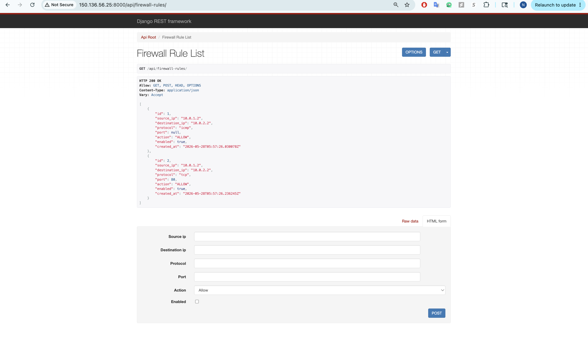
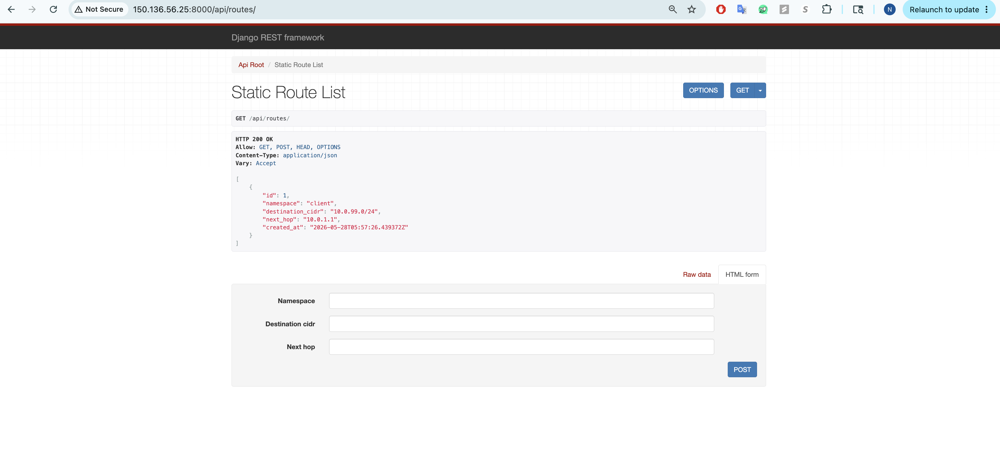
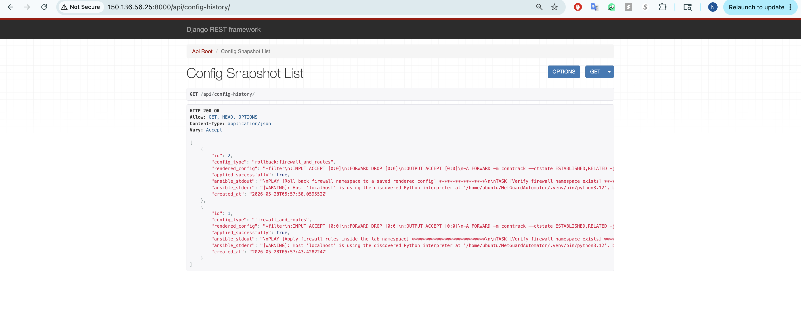
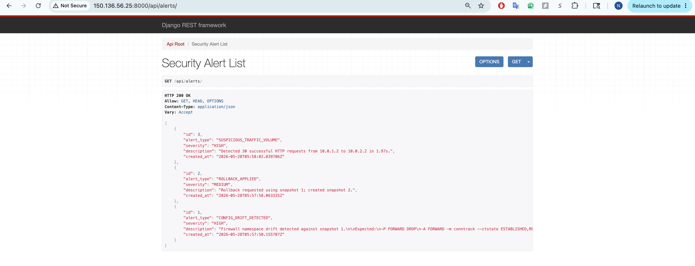
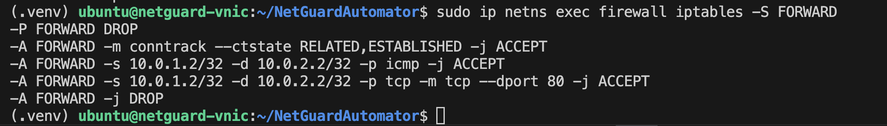
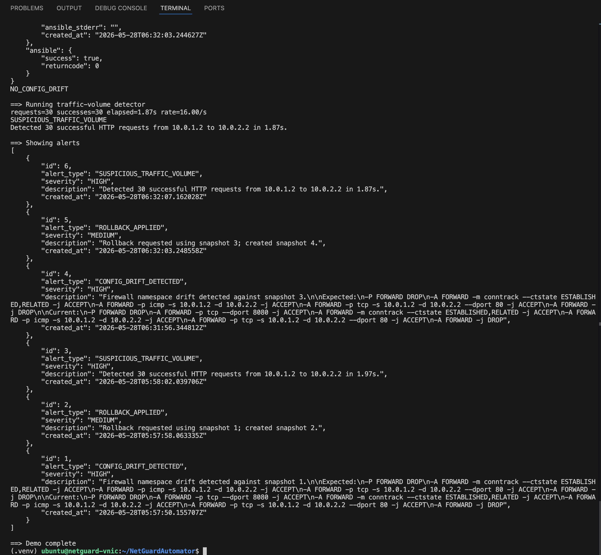

# Demo Evidence

Use this page as a checklist for screenshots and command output when presenting NetGuardAutomator.

## Hosted Demo URLs

If the Oracle Cloud VM is running and TCP `8000` is public, use these URLs:

```text
http://150.136.56.25:8000/api/firewall-rules/
http://150.136.56.25:8000/api/routes/
http://150.136.56.25:8000/api/config-history/
http://150.136.56.25:8000/api/alerts/
```

Use the hosted Oracle URL (`150.136.56.25:8000`) for portfolio screenshots so reviewers can connect the screenshots to the public demo.

## Screenshots

These screenshots were captured from the hosted Oracle deployment after running:

```bash
cd /home/ubuntu/NetGuardAutomator
source .venv/bin/activate
./scripts/demo.sh
```

### Firewall Rules API

Shows ICMP and TCP/80 allow rules served by the Django REST API.



### Static Routes API

Shows route records stored through the API.



### Config History API

Shows successful `firewall_and_routes` snapshots with rendered config and Ansible output.



### Security Alerts API

Shows drift, rollback, route, or suspicious traffic alerts after demo execution.



### Firewall Namespace Rules

Shows the actual `iptables` FORWARD chain inside the `firewall` namespace.



### Demo Complete Output

Shows the end-to-end demo completing successfully.



## Expected Demo Checkpoints

The end-to-end demo should include:

```text
Config applied with Ansible.
ROUTE_VERIFICATION_OK
HEALTH_CHECK_OK
NO_CONFIG_DRIFT
CONFIG_DRIFT_DETECTED
Rollback applied with Ansible.
SUSPICIOUS_TRAFFIC_VOLUME
==> Demo complete
```
